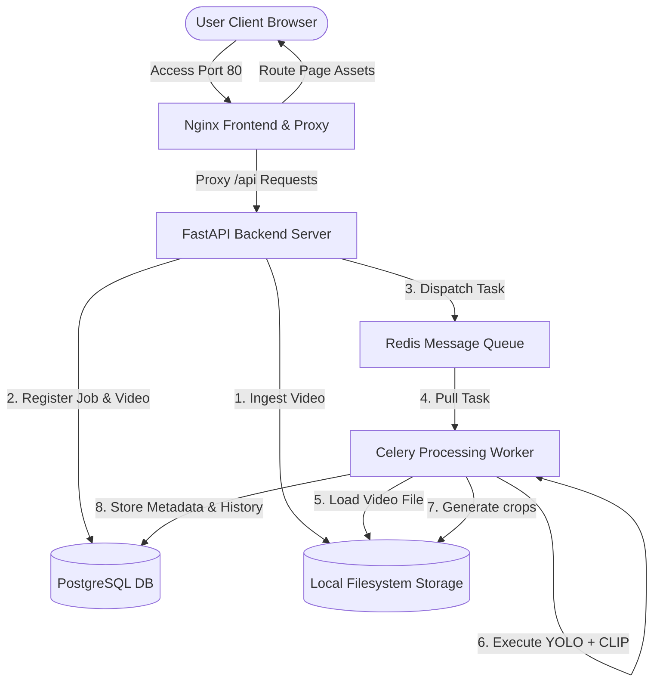
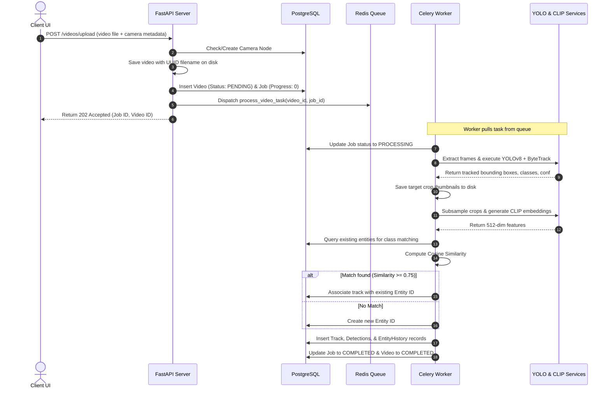

# System Architecture - AI Surveillance Platform

This document describes the high-level design, processing pipeline, AI pipelines, database schemas, scaling strategies, and tradeoffs for the CCTV Surveillance Platform.

## 1. High-Level Design

The platform uses a decoupled microservices architecture to separate the API ingestion layer, background processing workers, AI inference libraries, and database layers.

### System Architecture Diagram

---

## 2. Processing Pipeline

The video ingestion and analysis pipeline processes videos sequentially in the background using Celery workers:

---

## 3. AI Pipeline details

1. **Frame Extraction**: The Celery worker opens the video file using OpenCV's `VideoCapture` and streams frames sequentially.
2. **YOLO Detection**: Each frame is input to YOLOv8. Bounding boxes are filtered for target classes (e.g. people and vehicles) to reduce noise.
3. **ByteTrack Tracking**: Associations are computed using Hungarian matching on bounding box overlaps (IoU) and Kalman filters to maintain track IDs within the video stream.
4. **CLIP Embedding**: For each track, up to 5 visual crops are extracted. These crops are fed to the CLIP image encoder to generate normalized 512-dimensional feature vectors.
5. **Cross-Camera Matching**: Cosine similarity is calculated in-memory against database entities of the matching class. Detections exceeding the threshold (e.g., 0.75) are linked.

---

## 4. Database Design

We use a fully normalized relational PostgreSQL database schema with indexes tailored for historical searches:

- **cameras**: Unique camera nodes. Indexed on `(latitude, longitude)`.
- **videos**: Ingested CCTV footage files. Indexed on `camera_id` and `video_timestamp`.
- **processing_jobs**: Background Celery task progress. Indexed on `video_id`.
- **entities**: Global identity records. Indexed on `class_name`.
- **tracks**: Video-specific trajectories mapping local track IDs to global Entity IDs. Indexed on `entity_id` and `video_id`.
- **detections**: Individual frame bounding box parameters and crop file paths. Indexed on `track_id`, `video_id`, and `timestamp`.
- **entity_history**: Spatial-temporal movement history. Indexed on `entity_id`, `camera_id`, and `timestamp` (for fast path reconstructions on Leaflet maps).

---

## 5. Scaling Strategy

To scale this platform to 500+ videos (each up to 2 hours), we implement:
1. **Decoupled Workers**: Celery workers run independently. Adding more workers scales GPU/CPU processing capacity horizontally.
2. **GPU Inference Allocation**: Workers can be pinned to specific GPU resources.
3. **Database Partitioning**: Detections and entity history tables can be partitioned chronologically (by month or week) in Postgres to ensure queries remain fast as records grow.
4. **Vector Database Integration**: If the unique entity count grows to millions, cosine similarity checks can be offloaded to a specialized vector database (e.g., pgvector, Milvus, or Qdrant) which supports HNSW indexes for sub-millisecond similarity lookups.

---

## 6. Architectural Tradeoffs

- **CPU-only Default**: Running on CPU ensures immediate compatibility across developer environments but slows down processing times for large videos compared to NVIDIA CUDA acceleration.
- **In-Memory Cosine Similarity**: Computing similarities in-memory using NumPy is extremely fast for moderate entity sizes and avoids setting up specialized pgvector docker containers. As entity counts scale, this will need to migrate to an indexed database vector search.
- **Subsampling CLIP Crops**: Generating embeddings for a maximum of 5 crops per track reduces CLIP CPU processing time by over 90% while maintaining robust tracking representations.
